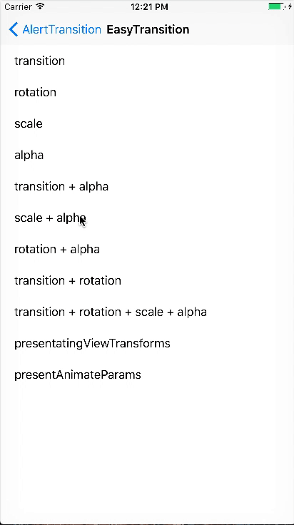
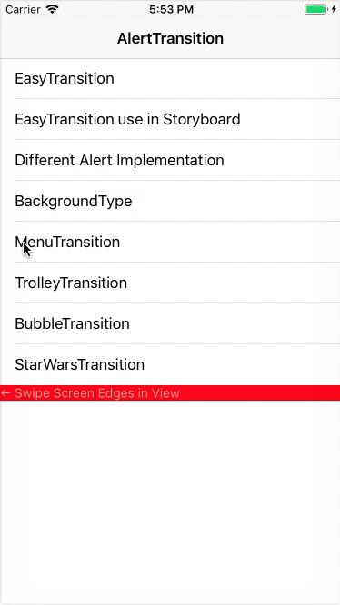
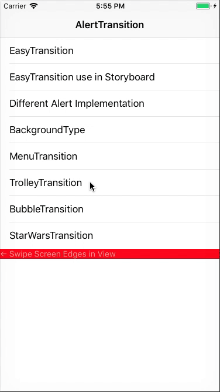
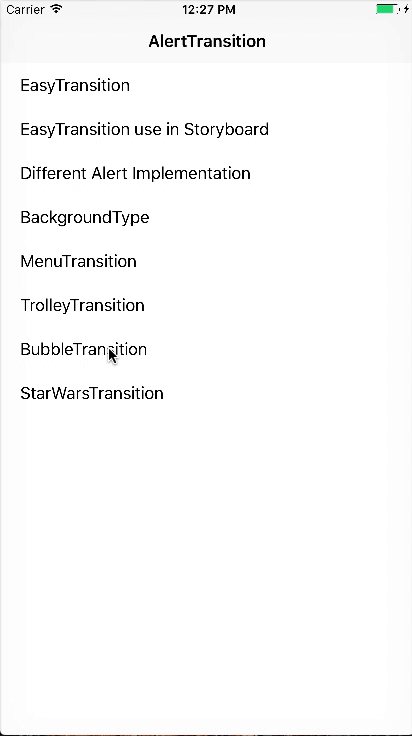
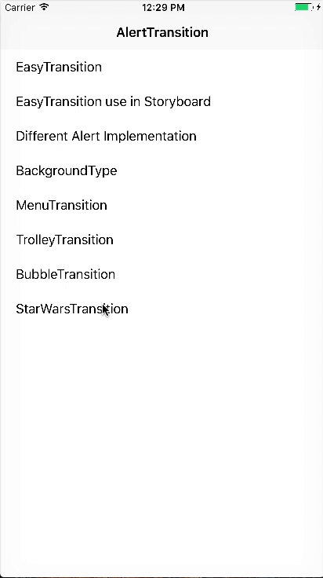

# AlertTransition


[](https://github.com/Carthage/Carthage)
[](https://cocoapods.org/pods/AlertTransition)

**AlertTransition** is a extensible library for making view controller transitions, especially for alert transitions. 

## Overview

**AlertTransition** is a super class, make basic structure, and no default animation realized.

**EasyTransition** is a subclass of **AlertTransition**. with it, you can compose custom transition with translation, scale, rotation and alpha. You can also change background with custom color or UIBlurEffect. It support changing device orientation. And it is easy to use both in code or storyboard.

<table>
 <tr>
  <td>
    
  </td>
  <td>
    
  </td>
  <td>
    
  </td>
 </tr>
</table>

**MenuTransition** is a subclass of **AlertTransition**. With it, you can make a side menu with a few line of codes.



**TrolleyTransition** is a subclass of **AlertTransition**. With it, you can make a trolley with a few line of codes.



***You can subclass AlertTransition, and write your custom transition***. And you can also wrap other transition effect with AlertTransition, such as [BubbleTransition](https://github.com/andreamazz/BubbleTransition) or [StarWars.iOS](https://github.com/Yalantis/StarWars.iOS). 

<table>
 <tr>
  <td>
    
  </td>
  <td>
    
  </td>
 </tr>
</table>

## AlertTransition

### How To Use

It is pretty simple to use AlertTransition

```swift
// First, initialize your presented controller
let alert = SomeController()
// Second, initialize a subclass of AlertTransition, such as EasyTransition, configure your controller with it
alert.at.transition = EasyTransition()
// Present your controller, Amazing!!
present(alert, animated: true, completion: nil)
```

If you use storyboard

```swift
override func prepare(for segue: UIStoryboardSegue, sender: Any?) {

	// First, find presented controller
	let controller = segue.destination 
	// Second, initialize a subclass of AlertTransition, such as EasyTransition, configure your controller with it  
	controller.at.transition = EasyTransition()
}
```

```swift
@IBAction func dismissButtonClicked() {
    dismiss(animated: true, completion: nil)
}
```

### Frame of Presented Controller

How to set the frame of presented controller? Conform to **AlertFrameProtocol** or **Self-sizing**

#### AlertFrameProtocol

Conforms to AlertFrameProtocol, provide your desired frame through property **alertFrame**

```swift
class SomeController: UIViewController, AlertFrameProtocol {
    
    var alertFrame: CGRect {
        let x = (UIScreen.main.bounds.size.width - 200) / 2
        let y = (UIScreen.main.bounds.size.height - 250) / 2
        return CGRect(x: x, y: y, width: 200, height: 250)
    }
}
```

#### Self-sizing

You need an unbroken chain of constraints and views (with defined heights) to fill the area between the controller view’s top edge and its bottom edge, and you also need one (with defined widths) between the controller view’s left edge and its right edge. If you know how to write [Self-sizing Cell](https://developer.apple.com/library/content/documentation/UserExperience/Conceptual/AutolayoutPG/WorkingwithSelf-SizingTableViewCells.html), this will be easy to you.

AlertTransition will calculate view's width and height, and set the presented controller in center of screen.

Sometimes, there maybe constraint conflicts. Among the chain of constraints, pick one constraint and reduce it's priority (eg: from 1000 to 999), everything will be fine.

You can find demo code in SnapKitAlertController.swift and Main.storyboard.

### Change background

You can change alert background with ***backgroundType***. Effect gif is the second image above. 

```swift
let alert = SomeController()

// It is a property of AlertTransition, you can use any subclass, just use EasyTransition as an example
let transition = EasyTransition()
transition.backgroundType = .blurEffect(style: .extraLight, alpha: 0.9)
// transition.backgroundType = .blurEffect(style: .light, alpha: 0.9)
// transition.backgroundType = .blurEffect(style: .dark, alpha: 0.9)
// transition.backgroundType = .color(UIColor.blue.withAlphaComponent(0.5))
    
alert.at.transition = transition
present(alert, animated: true, completion: nil)
```

## EasyTransition

You can easily compose your custom transition with a enum named **AnimationType**

```swift
let alert = SomeController()
let transition = EasyTransition()
transition.startTransforms = [.rotation(angle: CGFloat(Double.pi/2), anchorPoint: CGPoint(x: 0, y: 0)), .alpha(0)]
alert.at.transition = transition
present(alert, animated: true, completion: nil)
```

EasyTransition use **startTransforms** and final frame of presented controller's view, to calculate the state of start. The above sample code, the view will rotate pi / 2 with anchoPoint in left top corner, and alpha 0. 

There is also a property named **endTransforms**, it will have same value with **startTransforms** in default.

You can also change duration, damping, velocity, curve of the animation with **presentAnimateParams** and **dismissAnimateParams**

```swift
let alert = SomeController()
let transition = EasyTransition()
transition.presentAnimateParams.damping = 0.3
alert.at.transition = transition
present(alert, animated: true, completion: nil)
```

## MenuTransition

There are only three steps to make a side menu. Set frame and change background just like other *AlertTransition*.

```swift
class MainController: UIViewController {
    // First, hold your menu controller in your main controller
    var menuController = MenuController()
    
    override func viewDidLoad() {
        super.viewDidLoad()
        
        // second, initialize MenuTransition with presenting controller
        let transition = MenuTransition(from: navigationController)
        // third, set MenuTransition to your menuController
        menuController.at.transition = transition
    }
}
```

When you select an item at side menu, you want to push a controller from main controller. Push like this to make suitable animation.

```swift
(self.at.transition as? MenuTransition)?.push(controller: NextViewController())
```

## Write custom AlertTransition

In most cases, you only need to override func **performPresentedTransition** and **performDismissedTransition**. Apply your animation to **presentingView** and **presentedView**, such as TrolleyTransition:

```swift
public class TrolleyTransition: AlertTransition {

    public override init(from controller: UIViewController?) {
        super.init(from: controller)
        duration = 0.5
    }
    
    public override func performPresentedTransition(presentingView: UIView, presentedView: UIView, context: UIViewControllerContextTransitioning) {
        presentedView.frame.origin.y = UIScreen.main.bounds.height
        
        UIView.animate(withDuration: duration/2, animations: {
            presentingView.layer.transform = self.firstTransform()
        }) { (complete) in
            UIView.animate(withDuration: self.duration/2, animations: {
                presentingView.layer.transform = self.secondTransform()
                presentedView.transform = CGAffineTransform(translationX: 0, y: -presentedView.frame.height)
            }, completion: { (complete) in
                context.completeTransition(complete)
            })
        }
    }
    
    public override func performDismissedTransition(presentingView: UIView, presentedView: UIView, context: UIViewControllerContextTransitioning) {
        
        UIView.animate(withDuration: duration/2, animations: {
            presentedView.transform = CGAffineTransform.identity
            presentingView.layer.transform = self.firstTransform()
        }) { (complete) in
            UIView.animate(withDuration: self.duration/2, animations: {
                presentingView.layer.transform = CATransform3DIdentity
            }, completion: { (complete) in
                context.completeTransition(complete)
            })
        }
    }
    
    private func firstTransform() -> CATransform3D {
        var form = CATransform3DIdentity
        form.m34 = 1.0 / -900
        form = CATransform3DScale(form, 0.9, 0.9, 1)
        form = CATransform3DRotate(form, 15.0 * CGFloat(Double.pi)/180.0, 1, 0, 0)
        form = CATransform3DTranslate(form, 0, 0, -100.0)
        return form
    }
    
    private func secondTransform() -> CATransform3D {
        var form = CATransform3DIdentity
        form.m34 = firstTransform().m34
        form = CATransform3DTranslate(form, 0, -20, 0)
        form = CATransform3DScale(form, 0.9, 0.9, 1)
        return form
    }
}
```

If you want add UIPercentDrivenInteractiveTransition, or has custom UIPresentationController, set **interactionTransitionType** and **presentationControllerType** at init method.

```swift
public override init(from controller: UIViewController? = nil) {
    super.init(from: controller)
    
    interactionTransitionType = EasyPercentDrivenTransition.self
    presentationControllerType = SomePresentationController.self
}
```

If you write an amazing custom transition, please submit a pull requests. We looking forward to accumulate custom transitions. And with AlertTransition, we can easily change from one custom transition to another.

## Getting involved

* If you **want to contribute** please feel free to **submit pull requests**, even if you find some spell error in README, because I am not good at English.
* If you **have a feature request** please **open an issue**.
* If you **found a bug** or **need help** please **check older issues before submitting an issue**.

## Installation

### CocoaPods

[CocoaPods](https://cocoapods.org/) is a dependency manager for Cocoa projects.

Specify AlertTransition into your project's Podfile:

```ruby
source 'https://github.com/CocoaPods/Specs.git'
platform :ios, '8.0'
use_frameworks!

target '<Your App Target>' do
  #Swift3
  #pod 'AlertTransition', "~> 1.0.4"
  #Swift4
  pod 'AlertTransition', "~> 2.1.0"
end
```

If you only want EasyTransition, MenuTransition or TrolleyTransition, you can pod them alone like this:

```ruby
pod 'AlertTransition/Easy', "~> 2.1.0"
pod 'AlertTransition/Menu', "~> 2.1.0"
pod 'AlertTransition/Trolley', "~> 2.1.0"
```

Then run the following command:

```sh
$ pod install
```

### Carthage

[Carthage](https://github.com/Carthage/Carthage) is a simple, decentralized
dependency manager for Cocoa.

Specify AlertTransition into your project's Carthage:

```
github "loopeer/AlertTransition" ~> 2.1.0
```
